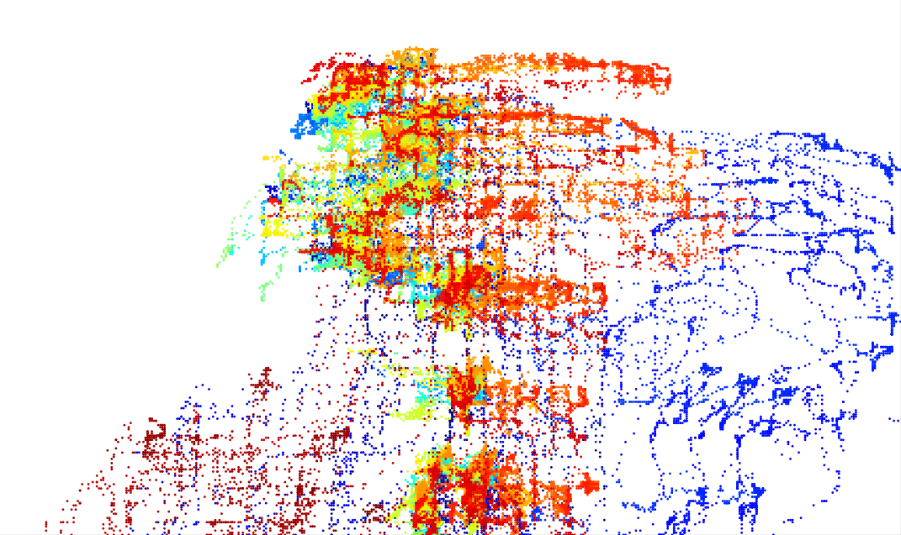
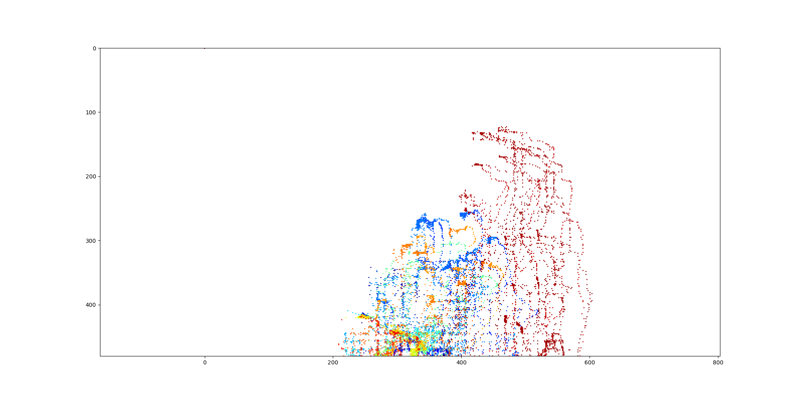
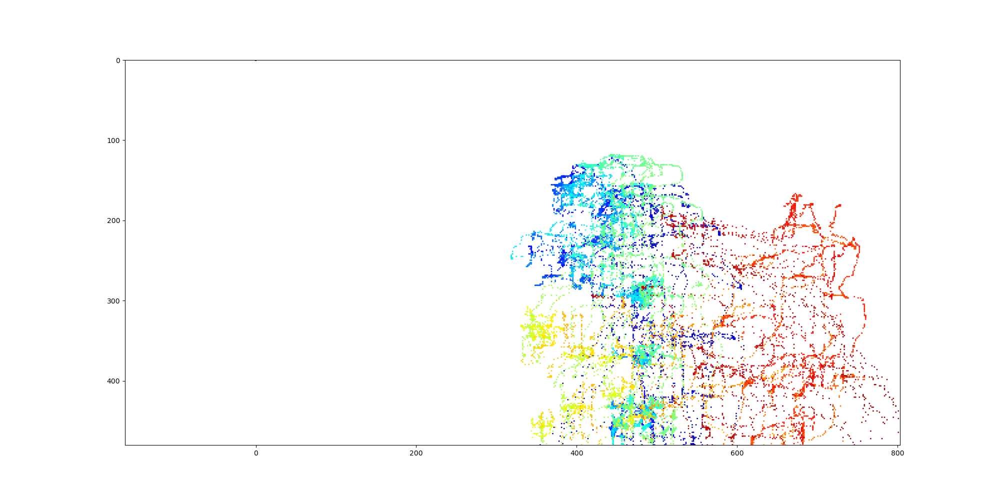
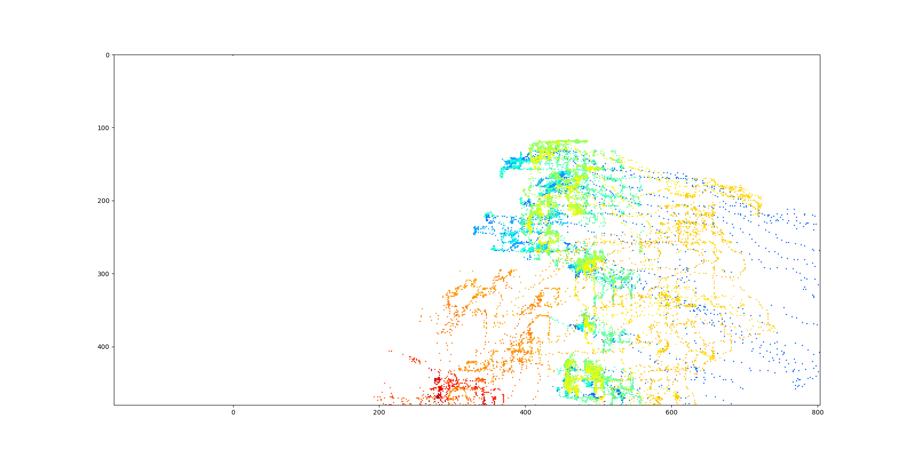

## Cluster body poses intro tracklets
Body pose estimators like [OpenPose](https://github.com/CMU-Perceptual-Computing-Lab/openpose) are really powerful tools
that can detect people in images and produce body skeletons for each indiviudal. When applied to videos, OpenPose 
produces an output json file for each frame of the video. If multiple people appear in the video (or if faulty skeletons 
are detected), these will be saved together for each frame.

The code in this repository allows to combine temporally all the skeleton files produced by OpenPose (or other software)
and cluster them together into trajectories, or "tracklets", to allow the analysis of each individual detected in the 
video.

## Getting Started

Open `cluster_pose_tracklets.py` and run it to see a working example.

### Prerequisites

The clustering function only requires `numpy` to work. To run the full example (with output images), `matplotlib` is
 required too.

### Usage
The input file is a zip archive containing the output json files of OpenPose. The script can be adapted to work without 
zip archives, but this makes the very large number of files more manageable.

The clustering function has 4 input parameters:
* `zip_path` Input zip file containing the .json poses detected by OpenPose
* `output_path` Output folder where the tracklets will be saved
* `min_occurences` Minimum number of skeletons a tracklets need to have to be considered valid
* `eps_skel` Minimum distance between two skeleton (in space and time) to be considered part of the same tracklet 
* `plot_info` Boolean, plot some useful debugging images to visualise the results
* `quiet` Boolean, keep the code quiet

### How it works
Clustering is performed iteratively by the `cluster_poses` function. The function assigns a `class_id` (or tracklet id)
to each skeleton. Each unclassified skeleton is compared to the next ones and the distance between the two is measured.
If this distance is less than a threshold, the two skeletons are assigned to the same tracklet. The process is repeated
untill all the skeletons are assigned to a tracklet.

The distance between skeletons is evaluated between all the body joints that are _valid_ (non-zero) in both skeletons.
The frame number is also included in the distance equation (i.e. skeletons that are very similar at different times
 will have higher distance than those that are consecutive).
 
 ### Example of tracklets:
 
   
 
 
 
 
## Contact

Alessandro Masullo - [@laumosl](https://twitter.com/laumosl) - [website](https://www.alessandromasullo.com)